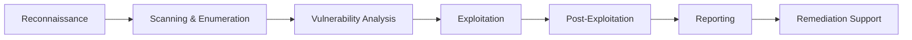

<div align="center">

# 🔐 Cybersecurity Specialist | Penetration Tester | Red Team Operator


</div>

---

## 🎯 About Me

```python
#!/usr/bin/env python3

class SecurityResearcher:
    def __init__(self):
        self.name = "Ahmed Shawky"
        self.alias = "Cypher0x00"
        self.role = "Penetration Tester"
        self.location = "Cairo, Egypt 🇪🇬"
        self.education = "B.Sc. Computer Science - Helwan University"
        self.language_spoken = ["ar_EG", "en_US"]
        
    def current_work(self):
        return {
            "position": "Penetration Tester - ITI ISI",
            "program": "Intensive Training Program (Mil-Tech 1)",
            "duration": "July 2025 - December 2025",
            "focus": "Advanced Penetration Testing & Red Team Operations"
        }
    
    def expertise(self):
        return {
            "specialization": ["Web Application Security", "Network Pentesting", 
                             "Malware Development", "Cryptographic Analysis"],
            "programming": ["Python", "C#", "PHP", "Bash"],
            "certifications": ["eWAPT - eLearnSecurity Web Application Penetration Tester"],
            "tools": ["Burp Suite", "Metasploit", "Nmap", "Wireshark", "SQLMap"]
        }
    
    def get_in_touch(self):
        return {
            "email": "cypher0x00@gmail.com",
            "linkedin": "https://linkedin.com/in/juba0x00",
            "portfolio": "https://ahmedshawky-portfolio.netlify.app",
            "phone": "+201019585858"
        }

me = SecurityResearcher()
print(f"👋 Welcome to {me.alias}'s Security Arsenal!")
print("🎯 Mission: Securing systems one vulnerability at a time.")
```

---

## 🛡️ Security Domains

<table>
<tr>
<td width="50%">

### 🔴 Offensive Security
- ✅ Web Application Penetration Testing
- ✅ Network Security Assessment
- ✅ Vulnerability Analysis & Exploitation
- ✅ Social Engineering Simulations
- ✅ Red Team Operations
- ✅ Security Auditing

</td>
<td width="50%">

### 🔵 Specialized Skills
- ✅ Malware Analysis & Development
- ✅ Cryptographic Analysis
- ✅ Post-Exploitation Techniques
- ✅ OWASP Top 10 Testing
- ✅ Database Security Testing
- ✅ API Security Assessment

</td>
</tr>
</table>

---

## 💻 Technology Stack

### 🖥️ Operating Systems
<p>


</p>

### 👨‍💻 Programming & Scripting
<p>


</p>

### 🔧 Penetration Testing Arsenal
<p>


</p>

### 🛠️ Development & DevOps Tools
<p>


</p>

### 🗄️ Database Systems
<p>


</p>

---

## 📊 GitHub Analytics

<div align="center">
  
  
</div>

<div align="center">
  
  
</div>

<div align="center">
  
</div>

---

## 🚀 Featured Security Projects

<div align="center">

<a href="https://github.com/cypher0x00/keylogger">
  
</a>

<a href="https://github.com/cypher0x00/RSA_DECRYPT">
  
</a>

</div>

### 🔥 Project Highlights

```yaml
Live Projects:
  - name: "KeystrokeGuard (Keylogger)"
    description: "Real-time keystroke monitoring with Telegram log exfiltration"
    features: ["Stealth Operation", "Real-time Logging", "Telegram Integration"]
    stack: ["Python", "Windows API", "Telegram Bot API"]
    use_case: "Authorized red-team simulations & security research"
    status: "✅ Production Ready"
    
  - name: "RSA_DECRYPT"
    description: "Cryptographic analysis and RSA decryption toolkit"
    features: ["RSA Decryption", "Key Analysis", "Cryptographic Utilities"]
    stack: ["Python", "Cryptography Libraries"]
    use_case: "Educational cryptographic analysis"
    status: "✅ Production Ready"

Upcoming Projects:
  - name: "Web Vulnerability Scanner"
    description: "Automated OWASP Top 10 vulnerability detection"
    stack: ["Python", "Requests", "BeautifulSoup"]
    status: "🚧 Planning Phase"
    
  - name: "Custom Reverse Shell Framework"
    description: "Advanced C2 with encryption and evasion techniques"
    stack: ["Python", "C#", "Networking"]
    status: "🚧 Planning Phase"
    
  - name: "Active Directory Attack Toolkit"
    description: "Post-exploitation automation for AD environments"
    stack: ["PowerShell", "Python", "Impacket"]
    status: "📋 Planned"
```

---

## 🎓 Education & Training

### 🎯 Professional Training
<table>
<tr>
<td width="70%">
<b>Information Technology Institute (ITI) - ISI</b><br>
Penetration Tester - Intensive Training Program (Mil-Tech 1)<br>
<i>Advanced penetration testing, red team operations, and security assessment</i>
</td>
<td width="30%">
<b>July 2025 - Dec 2025</b><br>
Cairo, Egypt
</td>
</tr>
</table>

### 🎓 Academic Education
<table>
<tr>
<td width="70%">
<b>Helwan University - Faculty of Computers and Informatics</b><br>
Bachelor of Computer Science & Informatics<br>
<i>Concentration: Information Systems</i>
</td>
<td width="30%">
<b>2020 - 2024</b><br>
Cairo, Egypt
</td>
</tr>
</table>

---

## 🏆 Certifications

<div align="center">

| Certification | Issuer | Status | Credential |
|--------------|--------|--------|------------|
| 🎯 **eWAPT** - Web Application Penetration Tester | eLearnSecurity | ✅ **Certified** | - |
| 🛡️ **Foundations of Cybersecurity** | Google | ✅ **Completed** | BARLGSAAOJ5C |
| 💻 **Foundational C# with Microsoft** | freeCodeCamp | ✅ **Completed** | ahmed4shawky-fcswm |

</div>

### 📚 Continuous Learning
```
Currently Exploring:
├─ Advanced Web Application Exploitation Techniques
├─ Network Penetration Testing Methodologies
├─ Red Team Operations & Tactics
├─ Malware Development & Analysis
└─ Cloud Security (AWS/Azure)
```

---

## 🏆 CTF Platforms & Achievements

<div align="center">

<a href="https://tryhackme.com/p/cypher0x00">
  
</a>
<a href="https://app.hackthebox.com/profile/2618038">
  
</a>
<a href="https://ctftime.org/user">
  
</a>

</div>

<div align="center">

### 🎯 Platform Profiles

| Platform | Username | Profile ID |
|----------|----------|------------|
| 🟦 TryHackMe | cypher0x00 | [Profile](https://tryhackme.com/p/cypher0x00) |
| 🟩 HackTheBox | Cipher0x00 | #2618038 |

</div>

```
🎯 Training Focus:
  ├─ Web Application Security
  ├─ Network Exploitation
  ├─ Post-Exploitation Techniques
  ├─ Privilege Escalation
  └─ CTF Challenges & War Games
```

---

## 🐛 Bug Bounty Journey

<div align="center">

```
🎯 Bug Bounty Status: Preparing to Launch

Currently building skills and preparing to join:
├─ HackerOne
├─ Bugcrowd
├─ Intigriti
└─ YesWeHack

Focus Areas:
├─ Web Application Vulnerabilities
├─ Authentication & Authorization Flaws
├─ API Security Issues
└─ OWASP Top 10 Vulnerabilities
```

</div>

---

## 💼 Professional Experience

<table>
<tr>
<td>

### 🎯 Information Technology Institute (ITI) - ISI
**Position:** Penetration Tester (Intensive Training Program - Mil-Tech 1)  
**Duration:** July 2025 - December 2025  
**Location:** Cairo, Egypt

**Responsibilities & Learning:**
- Advanced Web Application Penetration Testing
- Network Security Assessment & Exploitation
- Red Team Operations & Tactics
- Vulnerability Research & Analysis
- Security Tool Development
- Real-world Penetration Testing Scenarios

</td>
</tr>
</table>

---

## 💡 Core Competencies

<div align="center">

### 🔴 Penetration Testing Methodology



</div>

<table>
<tr>
<td width="33%">

### 🌐 Web Security
- SQL Injection
- XSS (Stored, Reflected, DOM)
- CSRF & Clickjacking
- Authentication Bypass
- Session Management Flaws
- File Upload Vulnerabilities
- SSRF & XXE
- API Security Testing

</td>
<td width="33%">

### 🖥️ Network Security
- Port Scanning & Service Enumeration
- Network Protocol Analysis
- Man-in-the-Middle Attacks
- Wireless Security Testing
- VPN & Firewall Testing
- Internal Network Pivoting
- Lateral Movement Techniques

</td>
<td width="33%">

### 🔐 Additional Skills
- Malware Analysis & Development
- Cryptographic Analysis
- Database Security Testing
- Social Engineering
- Security Automation
- Scripting & Tool Development
- Report Writing & Documentation

</td>
</tr>
</table>

---

## 📝 Technical Blog & Write-ups

<div align="center">

### 🌐 Portfolio & Blog
<a href="https://ahmedshawky-portfolio.netlify.app">
  
</a>

</div>

<!-- BLOG-POST-LIST:START -->
### 📚 Coming Soon:
- 🔐 Advanced Web Application Security Testing Techniques
- 🕷️ Understanding OWASP Top 10 in Real-World Scenarios
- 💉 Building Stealthy Keyloggers for Red Team Operations
- 🎯 Cryptographic Analysis: RSA Decryption Deep Dive
- 🌐 My Journey from Student to Penetration Tester
<!-- BLOG-POST-LIST:END -->

---

## 📚 Learning Resources & Community

<details>
<summary><b>🔴 Web Application Security</b></summary>

- OWASP Testing Guide
- PortSwigger Web Security Academy
- PentesterLab Web Challenges
- HackTheBox Web Challenges
- DVWA & WebGoat Practice
- Bug Bounty Platforms Research
</details>

<details>
<summary><b>🌐 Network Penetration Testing</b></summary>

- Network Protocol Analysis
- Internal Network Exploitation
- Pivoting & Lateral Movement
- Active Directory Attacks
- Wireless Security Assessment
</details>

<details>
<summary><b>🦠 Malware & Tool Development</b></summary>

- Custom Payload Creation
- Keylogger Development
- C2 Framework Understanding
- Anti-Virus Evasion Techniques
- Reverse Engineering Basics
</details>

<details>
<summary><b>🔐 Cryptography & Analysis</b></summary>

- RSA Cryptanalysis
- Encryption Algorithm Analysis
- Hash Function Security
- PKI & Certificate Analysis
</details>

---

## 🤝 Connect With Me

<div align="center">

<a href="https://linkedin.com/in/juba0x00">
  
</a>
<a href="https://ahmedshawky-portfolio.netlify.app">
  
</a>
<a href="mailto:cypher0x00@gmail.com">
  
</a>
<a href="https://tryhackme.com/p/cypher0x00">
  
</a>
<a href="https://app.hackthebox.com/profile/2618038">
  
</a>

### 📞 Contact Information
**Email:** cypher0x00@gmail.com  
**Phone:** +201019585858  
**Location:** Cairo, Egypt 🇪🇬

</div>

---

## 💭 Security Philosophy

<div align="center">

> *"Security is not a product, but a process."*  
> — Bruce Schneier

```
🎯 My Approach:
├─ Think like an attacker, defend like a guardian
├─ Every vulnerability found is a system made safer
├─ Continuous learning is the key to staying ahead
├─ Ethical hacking for a more secure digital world
└─ Always test with authorization, never cause harm
```

</div>

---

## ⚡ Fun Facts About Me

<div align="center">

```python
fun_facts = {
    "coding_hours": "Late night is the best time to code 🌙",
    "coffee_level": "Coffee-powered security researcher ☕",
    "favorite_os": "Linux terminal > GUI always 🐧",
    "ctf_addiction": "One more challenge... famous last words 🎯",
    "learning_mode": "Always on, never stops 📚",
    "passion": "Breaking things (legally) to make them stronger 🔨"
}

for fact, description in fun_facts.items():
    print(f"{fact}: {description}")
```

</div>

---

## 📊 Contribution Activity

<div align="center">


</div>

---

## 📈 Profile Statistics

<div align="center">


</div>

---

## ⚠️ Legal Disclaimer

<div align="center">

```
⚖️ IMPORTANT LEGAL NOTICE

All security tools, exploits, and techniques shared in this profile are for:

✅ Educational purposes and security research
✅ Authorized penetration testing with explicit permission
✅ Improving cybersecurity awareness and defense

❌ NEVER use these tools on systems without explicit written authorization
❌ Unauthorized access to computer systems is illegal under local and international law
❌ The author is NOT responsible for any misuse or illegal activities

⚠️ Always follow responsible disclosure practices and ethical hacking guidelines.
⚠️ Respect privacy, obtain proper authorization, and never cause harm.

Remember: With great power comes great responsibility. Hack ethically! 🛡️
```

</div>

---

## 💚 Support My Work

<div align="center">

If you find my projects useful or want to support my cybersecurity journey:

### ⭐ Star My Repositories

<a href="https://github.com/cypher0x00?tab=repositories">
  
</a>

**Every star motivates me to create more security tools and share knowledge! 🚀**

### 🤝 Collaborate

Interested in collaboration or have security project ideas?  
Feel free to reach out via [email](mailto:cypher0x00@gmail.com) or [LinkedIn](https://linkedin.com/in/juba0x00)!

</div>

---

<div align="center">


### 🔐 Happy Hacking! Stay Curious, Stay Secure! 🛡️

**Made with 💚 by Cypher0x00 | Ahmed Shawky**

*"The quieter you become, the more you can hear."* 🎯

</div>
